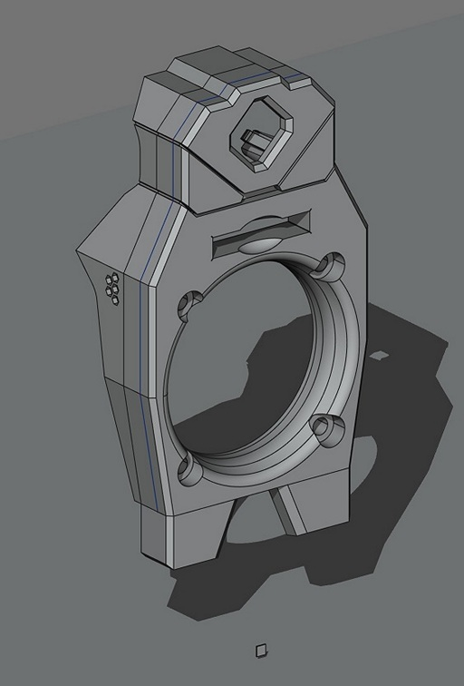
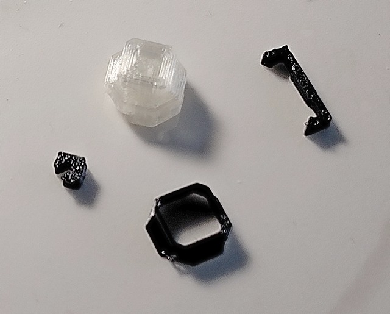
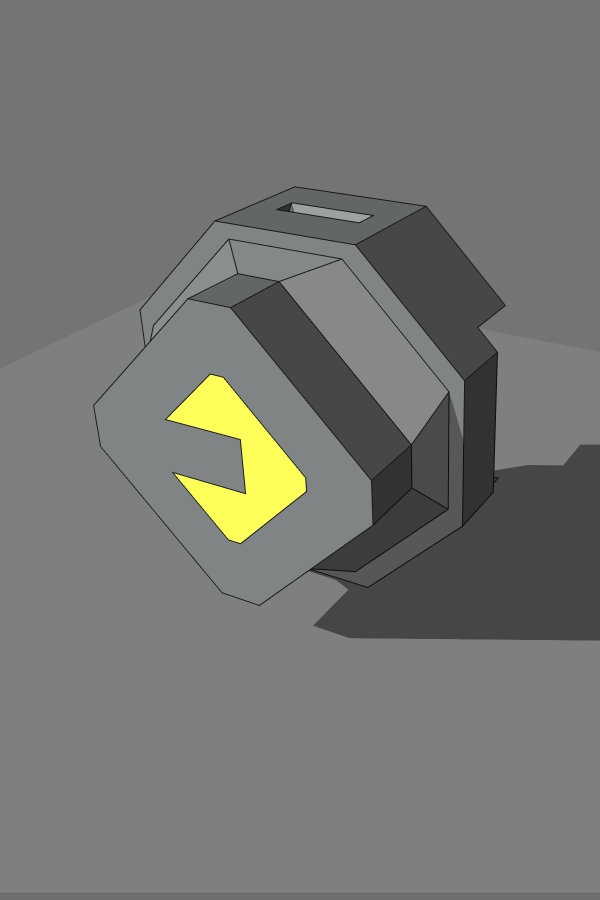
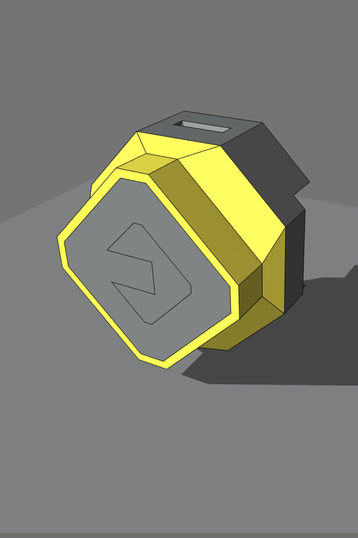
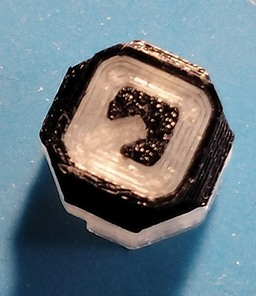
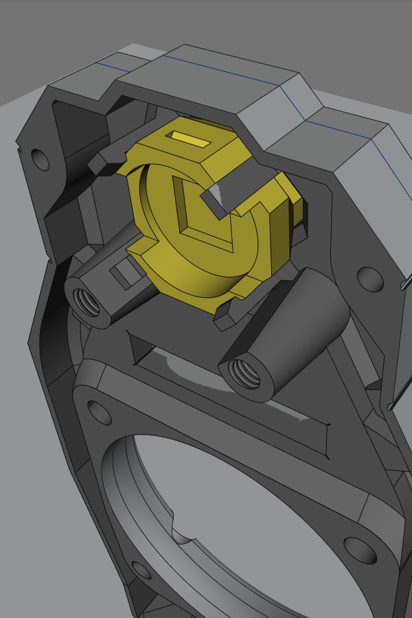
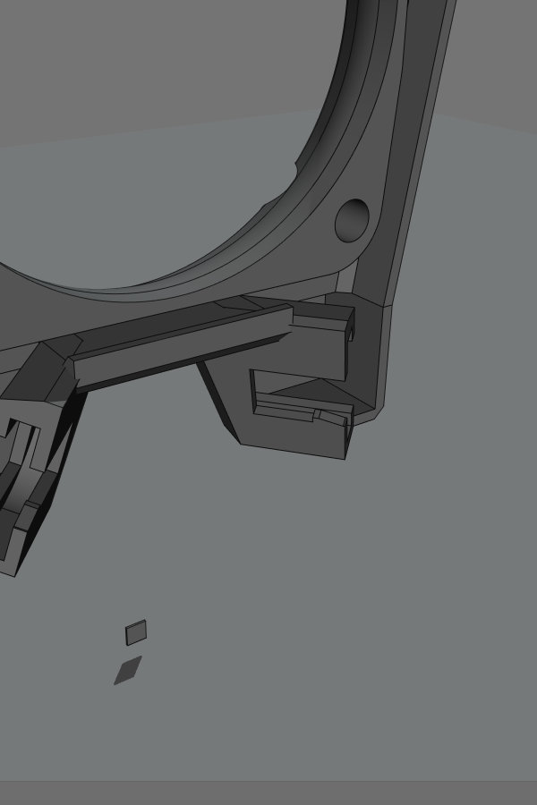
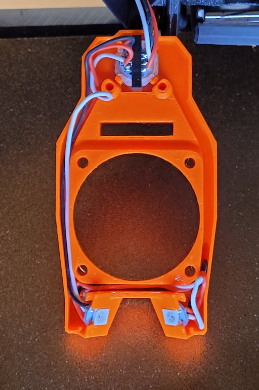
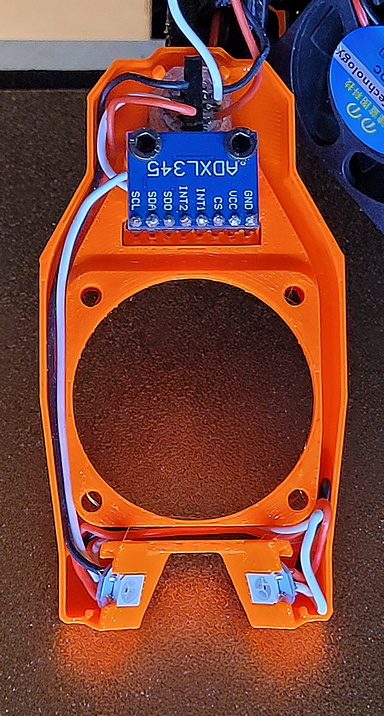

> Created by: [Stephen Lebed](https://github.com/slebed)

## Description
This is custom EVA shroud inspired by the Voron Stealthburner and Paweł Kucmus's EVA Queen shroud and carriage platform. This shroud should be a drop-in replacement for any EVA 2.4 shroud. Features of this shroud include a hidden ADXL345 mount, dual Neopixel RGB LEDs for seeing what you're printing and a Neopixel RGB LED backlit EVA logo.

#### Disclaimer
The names Voron, Stealthburner, EVA and Queen shroud are owned by their respective parties.

> **Warning:** These instructions are not complete!

## BOM
| No | Qty | Name                                           | Printable | Notes|
| -- | --- | ---------------------------------------------- | --------- |----------------------|
| 1  | 1   | King Shroud body                                | [Yes](stl/KingsShroud_v176_body.stl) |Print in primary color|
| 2  | 1   | King Shroud back cover                         | [Yes](stl/KingShroud_v176_back.stl)|Print in primary color|
| 3  | 1   | EVA Logo LED holder                            |  [Yes](stl/KingsShroud_v174-LogoLEDHolderLogoLEDHolderLEDHolder.stl)|Print in translucent or natural filament
| 4  | 1   | EVA Logo LED clip                           |  [Yes](stl/KingsShroud_v174-LogoLEDHolderLogoLEDHolderLEDclip.stl)|Print in any color
| 5  | 1   | EVA Logo sheath                            |  [Yes](stl/KingsShroud_v166-LogoLEDHolderLogoLEDHolderSheath.stl)|Print in black filament
| 6  | 1   | EVA Logo insert                            |  [Yes](stl/KingsShroud_v167-LogoLEDHolderLogoLEDHolderInsert.stl)|Print in black filament
| 7  | 1   | ADXL345                                        | No        |I used this one from [Amazon.com](https://www.amazon.com/dp/B08HLP1MPY/ref=cm_sw_em_r_mt_dp_ZATE89GFDS2K0VEVVJN0?_encoding=UTF8&psc=1)
|8|3|Neopixel LED (ws2812)|No|I used these from [Amazon.com](https://www.amazon.com/dp/B00P2GQUYC/ref=cm_sw_em_r_mt_dp_PMNZGTJADRJEV3NSN1C2?_encoding=UTF8&psc=1) but any compatible ones should work.
|9|3| 28awg stranded wire                                      |No     |I used this from [Amazon.ca](https://www.amazon.ca/dp/B07THYKBBK/ref=cm_sw_em_r_mt_dp_ZGJWJ1PHSKGGRQ51FVXV?_encoding=UTF8&psc=1)  
|10  | 4   | M3 x20mm Caphead screw                    		    | No        |
| 11  | 2   | M3 x8mm Caphead screw                          	  	| No        |Used for attaching ADXL to body
|12|2|10mm strand of plastic filament| No| Used to help secure the back wire cover to the body.

## Compatible EVA version

2.4 and newer.

## Print preparation

Print the KingsShroud_v176.stl face down on the bed in your primary color.  Note that these parts were designed to be printed with Petg and are a tight fit.  If printing in ABS, please allow for shrinkable.  Use 4 perimeters, 5 top and bottom layers.

> **Note:** The are four 'Pokey Poke' holes that will need to be drilled out prior to assembly.

## Assembly instructions

#### Assembling the Logo LED Holder

Here are the printed parts for the Logo LED Holder.

 - Press the EVA logo insert into the EVA Logo LED holder as shown in yellow below.

    

 - Press the EVA logo sheath onto the EVA logo LED holder as shown in yellow below.

    

    Example of the assembled LogoLEDHolder

     

 - Press the EVA logo LED holder into the back of the King Shroud body as shown in yellow below.  The part should press fit into the opening in the body.

    

#### Wiring the Neopixel (ws2812) LED harness

I used 28awg stranded wire cut to the following lengths: 3x 100mm long, 3x 60mm long, and 3x as long as you need to go from the first LED in line to a connector outside the King Shroud, at least 60mm.

- Solder the wires from the outside three pin connector to the 'IN' pins on the first LED.
- Solder the three 100mm wires from the 'OUT' of the first LED to the 'IN' of the second LED.
- Solder the three 60mm wires from the 'OUT' of the second LED so they all are laying over the three wires going 'IN'.
- Solder the other ends of the three 60mm wires to the 'IN' of the last LED.  

#### Inserting the LEDs into the King shroud

 - Starting with the last LED, insert it into the bottom right side of the King Shroud with the wires pointing out.  Slide the LED disk into the channel making sure the square housing of the LED should fits nicely into the slot.  The square LED housing should slide all the way into the channel.  A small nub will keep the LED from falling out.

- Insert the next LED into the left side bottom.  Make sure the LED is oriented so that all the wires are sticking out from the body.  Carefully press the LED completely into the holder for it.
- Using a small flathead screwdriver or Allen wrench, careful push the wires into the channels as shown below.
- Place the remaining LED into the Logo LED Holder.  Its wires should lay across in the small slot.  Press the clip over the LED so that it clicks into place.  Here is a photo showing the wiring and clip in place.

 

#### Wiring the adxl345

Your ADXL345 will need to have its connector pin soldered in place.  Insert the pin on the side with the components and solder them in place from behind.  Attach the ADXL345 using the two 8mm M3 screws.  Carefully screw them into the threaded holes until they are tight.

Here is an example of the accelerometer mounted in place.

 

#### Attaching the back wire cover

Take the two pieces of filament and insert each one into the holes at the top left and right side.  Press them into the holes as far as they will go.

Take the wires that go to the connector and pass them through the opening in the back cover.

Take the back cover and carefully lay it on the body.  There is a small grooved slot at the bottom that goes behind a tab above the bottom LED holders.  Align the two pieces of filament with their matching holes on the wire cover and press the cover closed.

Take the four M3 x 20mm screws and pass them through the front of the body.  Attach the toolhead fan to the four screws.  Place the entire assembly to your EVA carriage and attach it like you would any other shroud.
